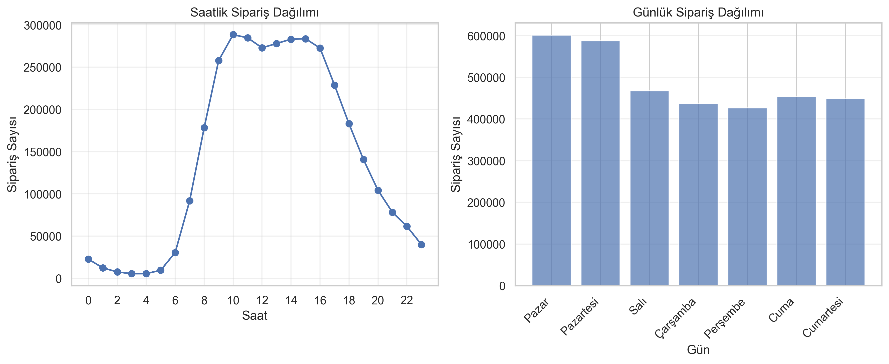

# Instacart – Next Product Reorder Prediction 

Zero2End Machine Learning Bootcamp Final Project

## 1. Proje Özeti

Bu proje, Instacart kullanıcılarının geçmiş alışveriş davranışlarını analiz ederek bir ürünün bir sonraki siparişte tekrar alınıp alınmayacağını tahmin eden uçtan uca bir makine öğrenimi sistemidir.  
Model, 3.4 milyon sipariş ve 32 milyon ürün hareketi verisi üzerinde eğitilmiştir.

Amaç, kullanıcı davranışlarını anlamak ve tekrar satın alma olasılığını yüksek doğrulukla tahmin ederek öneri sistemlerine ve stok planlamaya destek olmaktır.

**Model Performansı:**  
- F1 Score: 0.7779  
- Recall: 0.91  
- Precision: 0.69  
- Optimum Threshold: 0.40  

Detaylı teknik raporlar için:  
Bakınız: `docs/final_report.md` ve `docs/executive_presentation.md`

---

## 2. Demo / Canlı Uygulama

Streamlit tabanlı uygulama HuggingFace Spaces üzerinde dağıtılmıştır.

**Canlı Demo:**  
https://huggingface.co/spaces/4F71/instacart-reorder-prediction

---

## 3. EDA (Keşifsel Veri Analizi)

Aşağıdaki görseller, veri setine ait temel kullanıcı davranışlarını göstermektedir.

### Sipariş Zamanlaması (Saat/Gün Dağılımı)


### Siparişler Arası Gün Dağılımı


Bu analizler; müşterilerin alışveriş ritmini, sık alışveriş yapılan zaman dilimlerini ve tekrar satın alma davranışının süreksizliğini anlamak için kullanılmıştır.

Detaylar için bakınız:  
`docs/eda_report.md`

---

## 4. Feature Engineering ve Model Açıklanabilirliği

Model toplam 37 özellik ile eğitilmiştir.  
Özellikler; kullanıcı davranışları, ürün özellikleri ve kullanıcı-ürün etkileşimlerinden oluşturulmuştur.

### Özellik Önem Dereceleri


### SHAP Özellik Etki Analizi


Açıklanabilirlik çalışmaları marketing ve ürün ekiplerinin modelin karar mekanizmasını anlaması için kritiktir.

Detaylar:  
`docs/feature_engineering_report.md`

---

## 5. Model Performansı

Model LightGBM ile eğitilmiş, GroupKFold validasyon stratejisi kullanılarak veri sızıntısı engellenmiştir.

### Final Confusion Matrix


### Baseline Model Karşılaştırması (Opsiyonel)


Detaylı metrik değerlendirmesi:  
`docs/evaluation_report.md`  
`docs/training_report.md`

---

## 6. Pipeline Mimarisi

Model ve sistem mimarisi aşağıdaki uçtan uca pipeline üzerinde çalışmaktadır:

1. Veri yükleme ve bellek optimizasyonu  
2. Keşifsel veri analizi  
3. Özellik mühendisliği  
4. Baseline model  
5. LightGBM final modeli (Optuna optimizasyonlu)  
6. Veri sızıntısı kontrolü  
7. GroupKFold validasyonu  
8. Performans değerlendirme  
9. Deployment  
10. Monitoring

Tam teknik akış için bakınız:  
`docs/final_report.md`

---

## 7. Monitoring (İzleme Sistemi)

Model performansı ve kullanıcı tahminleri gerçek zamanlı olarak monitoring dashboard üzerinden takip edilir.

### Dashboard Genel Görünüm


### Tahmin Detayları


Monitoring, SQLite tabanlı hafif bir log mekanizması ile çalışır.

Detaylar:  
`docs/deployment_report.md`

---

## 8. Kullanılan Teknolojiler

- Python 3.10  
- NumPy, Pandas  
- Scikit-learn  
- LightGBM  
- Optuna  
- Streamlit  
- SQLite  
- Docker  
- HuggingFace Spaces  
- GitHub Actions

---

## 9. Local Kurulum

Aşağıdaki komutlarla uygulamayı yerel ortamda çalıştırabilirsiniz.

```
git clone https://github.com/4F71/instacart-next-product-recommendation.git
cd instacart-next-product-recommendation
```

Sanal Ortam
```
python -m venv .venv
source .venv/bin/activate   # Windows: .venv\Scripts\activate
```

Bağımlılıkların Yüklenmesi
```
pip install -r requirements.txt
```

Uygulama Başlatma
```
streamlit run src/app_streamlit.py
```

Monitoring Dashboard (İsteğe Bağlı)

```
streamlit run monitoring/dashboard.py
```
Docker
```
docker build -t instacart-app .
docker run -p 7860:7860 instacart-app
```

10. Repo Yapısı
```
proje/
├── notebooks/
│   ├── 01_eda.ipynb
│   ├── 02_baseline.ipynb
│   ├── 03_feature_engineering.ipynb
│   ├── 04_model_training.ipynb
│   ├── 05_model_evaluation.ipynb
│   └── 06_final_pipeline.ipynb

├── docs/
│   ├── problem_definition.md
│   ├── eda_report.md
│   ├── feature_engineering_report.md
│   ├── baseline_report.md
│   ├── training_report.md
│   ├── evaluation_report.md
│   ├── deployment_report.md
│   ├── final_report.md
│   ├── model_card.md
│   └── executive_presentation.md

├── src/
│   ├── app_streamlit.py
│   ├── inference.py
│   ├── config.py
│   └── __init__.py

├── models/
│   ├── lgb_model_final.pkl
│   ├── feature_names.json
│   └── best_threshold.txt

├── figures/
│   ├── aisles_top20.png
│   ├── baseline_confusion_matrix.png
│   ├── cart_order_distribution.png
│   ├── confusion_matrix_final.png
│   ├── departments_top20.png
│   ├── feature_importance_final.png
│   ├── orders_days_since_prior.png
│   ├── orders_temporal_distribution.png
│   ├── products_top20.png
│   ├── shap_summary_plot.png
│   ├── threshold_optimization.png
│   ├── train_reordered_distribution.png
│   └── monitoring/
│       ├── demo_ui_placeholder.png
│       ├── monitoring_dashboard_overview.png
│       └── monitoring_dashboard_details.png

├── monitoring/
│   ├── dashboard.py
│   └── predictions.db
|   └── log.py
| 
├── Dockerfile
├── requirements.txt
└── README.md
```

11. Raporlar

Tüm teknik raporlar docs/ klasöründedir:

`problem_definition.md`  
`eda_report.md`  
`feature_engineering_report.md`  
`baseline_report.md`  
`training_report.md`  
`evaluation_report.md`  
`deployment_report.md`  
`final_report.md`  
`model_card.md`  
`executive_presentation.md`

12. Medium Yazısı

Projenin tüm hikayesini, öğrenim sürecini ve teknik akışın özetini içeren yazı:

https://medium.com/@yedisarman/32-milyon-satırlık-veri-junior-ml-developer-b97c5d6e9684

13. İletişim

- Geliştirici: Onur Tilki (4F71)  
- GitHub: https://github.com/4F71
- HF: https://huggingface.co/4F71
- Linkedin: www.linkedin.com/in/onurtilki
- E-posta: [mehmetonurt@gmail.com]

14. Sonuç

Bu proje, e-ticaret alanında tekrar satın alma tahmini için geliştirilmiş kapsamlı bir makine öğrenimi pipeline’ıdır.  
Veri analizi, model geliştirme, değerlendirme, dağıtım ve izleme aşamalarının tamamını kapsayan uçtan uca bir mimari sunulmuştur.
